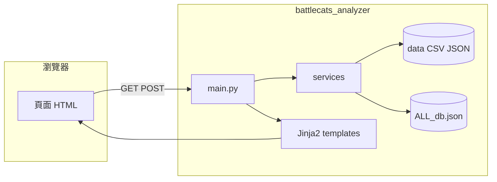

# Battle Cats Analyzer（ajuju 期末專案）

> **給組員的一句話**：貓咪大戰爭的「抽卡建議 + 角色強度分析」網站。  
> 組員用 Python / Notebook 算分、匯出 CSV；網站用 FastAPI 讀檔顯示，**線上不訓練模型**。

**本 README 位置**：`Ajuju/README.md`（工作區根目錄）  
**Git / Render 程式根目錄**：`ajuju_mission/`（GitHub: [lywlyw613/ajuju](https://github.com/lywlyw613/ajuju)）

---

## 目錄

1. [專案總覽](#1-專案總覽)
2. [用了哪些 Library？](#2-用了哪些-library)
3. [組員檔案地圖：誰的東西做什麼](#3-組員檔案地圖誰的東西做什麼)
4. [資料怎麼從 ML 流到網站](#4-資料怎麼從-ml-流到網站)
5. [網站架構（必讀）](#5-網站架構必讀)
6. [網站怎麼用（給使用者）](#6-網站怎麼用給使用者)
7. [數字從哪來？](#7-數字從哪來)
8. [本機怎麼跑](#8-本機怎麼跑)
9. [部署 Render](#9-部署-render)
10. [FAQ](#10-faq)
11. [Changelog](#11-changelog)
12. [README 維護規則](#12-readme-維護規則)

---

## 1. 專案總覽

### 分工（概念上）

| 角色 | 負責內容 | 主要產出 |
|------|----------|----------|
| **爬蟲 / 資料** | 從 battlecats-db 等來源抓角色 JSON | `DA_ML_期末專案/` 內 JSON |
| **特徵 / 模組分 ML** | 面板、特攻、控場三模組 0–10 分 | `module_scores_export.csv` |
| **稀有度 / 綜合評分 ML** | XGBoost 預測 0–5 綜合分 | `battlecats_final_tier_list.csv` |
| **卡池 EV / 推薦** | 抽卡期望值、要不要抽 | `DA_ML_PoolScore` notebook → 網站引擎 |
| **評語 / 文案** | 泛用性、戰術、培養建議 | `id_review_sections_export.csv` |
| **網站** | 頁面、Session、部署 | `battlecats_analyzer/` |

### 技術選型（為什麼這樣做）

| 選擇 | 原因 |
|------|------|
| **FastAPI** | Python 寫 API + 頁面路由，和 ML 組語言一致 |
| **Jinja2 模板** | 不用 React，改 HTML 就能改畫面 |
| **CSV / JSON 當資料庫** | Render 免費方案簡單；模型離線算好再匯入 |
| **Session 存持有清單** | 不用登入帳號；cookie 記住勾選 |
| **Render 部署** | 長駐 Python；Vercel 不適合大 JSON + sklearn |

---

## 2. 用了哪些 Library？

### 2.1 線上網站（Render 實際安裝）

檔案：`ajuju_mission/battlecats_analyzer/requirements.txt`

| 套件 | 版本約束 | 做什麼用 |
|------|----------|----------|
| **fastapi** | 0.110–0.115 | Web 框架：路由、Request、Form、回傳 HTML |
| **uvicorn[standard]** | 0.27–0.34 | ASGI 伺服器，跑 `main:app` |
| **jinja2** | ≥3.1 | 模板引擎，`.html` 裡 `{{ }}` / `` |
| **python-multipart** | ≥0.0.9 | 解析 POST 表單（勾選框 `selected_ids`） |
| **itsdangerous** | ≥2.1 | Starlette Session 簽 cookie（配合 SessionMiddleware） |

**Python 標準庫（沒寫在 requirements 但很重要）**

| 模組 | 用途 |
|------|------|
| `csv` | 讀 tier list、模組分、評語 CSV |
| `json` | 讀卡池 mapping、角色 JSON |
| `pathlib` | `config.py` 裡所有檔案路徑 |
| `urllib.request` | `/image/{id}` 代理官方角色圖 |

**Starlette（隨 FastAPI 安裝）**

| 元件 | 用途 |
|------|------|
| `SessionMiddleware` | 存 `owned_cat_ids`（使用者勾選的持有角色） |
| `StaticFiles` | 提供 `/static/style.css` |
| `HTMLResponse` | 回傳渲染好的 HTML 字串 |

### 2.2 本機 ML / 完整開發（Render 預設不裝）

檔案：`ajuju_mission/battlecats_analyzer/requirements-ml.txt`（會 `-r requirements.txt`）

| 套件 | 用途 |
|------|------|
| **numpy** | 數值矩陣、ML 特徵 |
| **pandas** | `features.py` / `scoring.py` DataFrame |
| **scipy** | `ml_train.py` Spearman 等統計 |
| **scikit-learn** | RandomForest 模組分訓練 |
| **beautifulsoup4** | 爬蟲 notebook 解析 HTML |
| **requests** | 爬蟲 HTTP |

### 2.3 Notebook / Colab 額外使用（不在 requirements 裡）

組員在 Google Colab 或本機 notebook 常另外裝：

| 套件 | 用在哪 |
|------|--------|
| **xgboost** | `卡池預測/DA_ML_rare_model.ipynb` 預測綜合評分 |
| **pandas / numpy** | 所有 PoolScore、rare_model notebook |

> Render 設 `SKIP_ML_BUILD=true`，**不會**在伺服器上 import sklearn / 跑 RandomForest，只讀匯好的 CSV。

---

## 3. 組員檔案地圖：誰的東西做什麼

```
Ajuju/
├── README.md                          ← 本文件
├── 卡池預測/                          ← 卡池 EV、綜合評分 notebook + 原始匯出
├── id_review_sections_export.csv      ← 評語（根目錄副本；網站用 mission 內 data/）
│
└── ajuju_mission/                     ← Git repo 根
    ├── battlecats_analyzer/           ← ★ 網站
    ├── battle_cats_ml_test3/          ← 模組分 ML
    ├── DA_ML_期末專案/                ← 爬蟲
    └── BattleCats_Output/             ← 稀有度對照表
```

### 3.1 `卡池預測/`（卡池期望值 + 綜合評分 pipeline）

| 檔案 | 作用 | 和網站的關係 |
|------|------|--------------|
| `DA_ML_PoolScore.ipynb 的副本` | **核心**：`calculate_gacha_explanation_engine(pool, owned_ids)`；算 ev_initial、ev_current、recommendation_level、pockets、display_explanations；全池排行 `gacha_recommendation_system_pr` | 邏輯已移植到 `battlecats_analyzer/services/gacha_explanation_engine.py` |
| `DA_ML_rare_model.ipynb 的副本` | XGBoost：模組1/2/3 分 → 預測 **綜合評分**；產出 tier list | 匯出 CSV 複製到 `battlecats_analyzer/data/battlecats_final_tier_list.csv` |
| `battlecats_final_tier_list (1).csv` | 每隻 ID 的綜合評分、等第、真實/預測分 | 網站正式檔：`data/battlecats_final_tier_list.csv` |
| `gacha_pool_characters_mapping (1).json` | 日文卡池名 → `{SSR:[], SSSR:[]}` | 網站正式檔：`data/gacha_pool_characters_mapping.json` |
| `battlecats_ssr_db_cleaned.json` | 清洗後 SSR 資料（ML 中間產物） | 供 rare_model 訓練；網站不直接讀 |
| `battlecats_sssr_db_cleaned.json` | 清洗後 SSSR 資料 | 同上 |

### 3.2 `ajuju_mission/battle_cats_ml_test3/`（三模組分 0–10）

| 檔案 | 作用 | 和網站的關係 |
|------|------|--------------|
| `features.py` | 從 JSON 抽面板數值、能力特徵 → DataFrame | 本機 `SKIP_ML_BUILD=false` 時 `catalog.py` 會呼叫 |
| `scoring.py` | **模組1** 面板加權、**模組2** 屬性特攻、**模組3** 控場；min-max 縮到 0–10 | 同上；正式環境改用 CSV |
| `ml_train.py` | RandomForest 訓練、Spearman 評估 | 離線訓練；結果匯出 CSV |
| `data_io.py` | 讀 JSON、選角「哪一階形態」(`pick_form`) | 網站 `catalog.py` 直接用 |
| `game_labels.py` | 能力 ID → 中文名 | 詳情頁能力標籤 |
| `display_utils.py` | 列出啟用中的能力 | 詳情頁 |
| `battle_cats_ml_test3.ipynb` | 互動訓練、匯出流程 | 產出 `module_scores_export.csv` |
| `battlecats_ALL_db.json` 等 | ML 用 JSON 副本 | 與爬蟲資料同源 |

**模組分 CSV 欄位**（網站 `roster_analysis.py` 讀取）：

`角色ID, 模組1分數, 模組2分數, 模組3分數, 模組1等第, 模組2等第, 模組3等第`

### 3.3 `ajuju_mission/DA_ML_期末專案/`（爬蟲與原始資料）

| 路徑 | 作用 |
|------|------|
| `爬蟲/DA_ML_期末專案_爬蟲.ipynb` | 爬 battlecats-db，寫入 JSON |
| `爬蟲/rated_data/battlecats_ALL_db.json` | **全角色** 最大 JSON（約 56MB）；含各階段面板、能力 |
| `爬蟲/rated_data/score.csv` | 人工評分標籤（訓練用） |
| `爬蟲/not_rated_data/*.json` | 未評分版本 |
| `data_set/*_cleaned.json` | 清洗後訓練 / 預測集 |

**網站讀哪一份 JSON？**  
`config.py` → `DATA_JSON = ajuju_mission/DA_ML_期末專案/爬蟲/rated_data/battlecats_ALL_db.json`  
（啟動時載入角色名、能力、詳情；Render 上靠 `SKIP_ML_BUILD` 略過即時算分）

### 3.4 `ajuju_mission/BattleCats_Output/`

| 檔案 | 作用 |
|------|------|
| `gacha_id_list.json` | `{ "449": "SSR", "706": "SSSR", ... }` 全角色稀有度對照 |

`catalog.py` 用來補稀有度標籤；卡池成員以 `gacha_pool_characters_mapping.json` 為準。

### 3.5 `ajuju_mission/battlecats_analyzer/data/`（網站正式讀取的資料）

| 檔案 | 誰維護 | 網站誰讀 |
|------|--------|----------|
| `battlecats_final_tier_list.csv` | rare_model 組 | `tier_list.py` → 綜合分、星等、卡池 EV |
| `module_scores_export.csv` | ml_test3 組 | `roster_analysis.py` → 陣容評分、詳情模組條 |
| `gacha_pool_characters_mapping.json` | PoolScore / 卡池 mapping 組 | `gacha_pools.py`、EV 引擎 |
| `id_review_sections_export.csv` | 評語組 | `review_sections.py` → Explanation 短評 |

**更新資料的标准流程**：notebook 匯出 → 覆蓋 `data/` 對應檔 → 本機測試 → commit → push Render。

### 3.6 網站程式目錄（交付用）

見 [§5 網站架構](#5-網站架構必讀) 各檔說明。

---

## 4. 資料怎麼從 ML 流到網站

```
┌─────────────────────────────────────────────────────────────────┐
│ 1. 爬蟲 DA_ML_期末專案_爬蟲.ipynb                                  │
│    → battlecats_ALL_db.json（角色面板、能力、名字）                  │
└────────────────────────────┬────────────────────────────────────┘
                             ▼
┌─────────────────────────────────────────────────────────────────┐
│ 2. battle_cats_ml_test3（features + scoring + RandomForest）       │
│    → module_scores_export.csv（模組1/2/3）                         │
└────────────────────────────┬────────────────────────────────────┘
                             ▼
┌─────────────────────────────────────────────────────────────────┐
│ 3. DA_ML_rare_model.ipynb（XGBoost）                               │
│    → battlecats_final_tier_list.csv（綜合評分 0–5）                │
└────────────────────────────┬────────────────────────────────────┘
                             ▼
┌─────────────────────────────────────────────────────────────────┐
│ 4. 卡池 mapping JSON + PoolScore 引擎                               │
│    → 網站 gacha_explanation_engine.py（EV、推薦、pockets）          │
└────────────────────────────┬────────────────────────────────────┘
                             ▼
┌─────────────────────────────────────────────────────────────────┐
│ 5. id_review_sections_export.csv（人工/規則評語）                   │
│    → 角色短評、詳情文字區塊                                          │
└────────────────────────────┬────────────────────────────────────┘
                             ▼
                    FastAPI 渲染 HTML 給使用者
```

---

## 5. 網站架構（必讀）

### 5.1 整體分層

```
瀏覽器
   │  HTTP GET/POST
   ▼
main.py                 ← 路由、Session、組裝 template context
   │
   ├── services/         ← 業務邏輯（不算分就在這，算分也在這）
   │     ├── catalog.py
   │     ├── tier_list.py
   │     ├── gacha_pools.py
   │     ├── gacha_explanation_engine.py
   │     ├── pool_analysis.py
   │     ├── roster_analysis.py
   │     └── review_sections.py
   │
   ├── data/*.csv|json   ← 靜態資料（部署時打包進 repo）
   │
   └── templates/        ← Jinja2 HTML + partials
         static/style.css
```

**沒有**獨立前端專案、**沒有**資料庫、**沒有** REST JSON API 給外部 App（全是 Server-Side Rendering 網頁）。

### 5.2 一次請求的生命週期（例：開卡池分析頁）

```
GET /gacha/pool?pool=超ネコ祭ガチャ
        │
        ▼
main.gacha_pool_page()
        │  _load_owned_session()  ← cookie 讀 owned_cat_ids
        ▼
_gacha_context()
        ├── get_gacha_pool()           ← catalog + gacha_pools
        ├── analyze_roster()           ← module_scores CSV
        └── analyze_pool()             ← gacha_explanation_engine + review CSV
        ▼
templates/gacha_pool.html
        ├── partials/pool_report_section.html
        └── partials/pool_engine_data.html
        ▼
HTML 回傳瀏覽器
```

### 5.3 路由表（`main.py`）

| 方法 | 路徑 | 函式 | 模板 | 說明 |
|------|------|------|------|------|
| GET | `/` | `home` | `index.html` | 首頁輪播、新手教學 |
| GET | `/gacha` | `gacha_page` | `gacha.html` | 卡池主頁、勾選持有 |
| POST | `/gacha` | `gacha_post` | `gacha.html` | 儲存 Session + 表單 |
| GET | `/gacha/lineup` | `gacha_lineup_page` | `gacha_lineup.html` | 陣容評分 |
| GET | `/gacha/pool` | `gacha_pool_page` | `gacha_pool.html` | 卡池 EV 分析 |
| GET | `/gacha/rankings` | `gacha_rankings_page` | `gacha_rankings.html` | 全池 EV 排行 |
| GET | `/search` | `search_page` | `search.html` | 搜尋 |
| GET | `/character/{id}` | `character_page` | `detail.html` | 角色詳情 |
| GET | `/image/{id}` | `proxy_unit_image` | — | PNG 代理快取 |

### 5.4 `services/` 各檔職責

| 檔案 | 輸入 | 輸出 | 說明 |
|------|------|------|------|
| `catalog.py` | ALL_db.json, tier CSV, gacha_id_list | 角色列表、詳情 dict | 中央 catalog；搜尋、卡池列表、詳情都經這裡 |
| `tier_list.py` | `battlecats_final_tier_list.csv` | ID → 綜合分、等第、星等 | 快取 `_cache` |
| `gacha_pools.py` | `gacha_pool_characters_mapping.json` | 池名列表、池內 ID | `resolve_pool_key` 處理預設池 |
| `gacha_explanation_engine.py` | pool_name + owned_ids | ev、pockets、文案 | **PoolScore notebook 移植** |
| `pool_analysis.py` | 呼叫 engine + characters | 給模板用的 pool_report | 包一層 + 評語列表 |
| `roster_analysis.py` | owned_ids | lineup 陣容評分 | 三模組平均 |
| `review_sections.py` | id_review CSV | 泛用性/戰術/培養 bullets | Explanation 用 |

### 5.5 模板結構

| 模板 | 繼承 | 重點 |
|------|------|------|
| `base.html` | — | 手機殼 layout、導覽、載入 CSS |
| `index.html` | base | 輪播、新手指南 |
| `gacha.html` | base | 池選擇、快捷卡片、角色 grid、POST form |
| `gacha_lineup.html` | base | `partials/lineup_section.html` |
| `gacha_pool.html` | base | `pool_report_section` + `pool_engine_data` |
| `gacha_rankings.html` | base | 全池 EV 表格 |
| `search.html` | base | 搜尋結果 grid |
| `detail.html` | base | 模組三條、評語、能力 |
| `partials/*.html` | — | 可重用區塊，避免複製貼上 |

**UI 設計**：`.phone-shell` 寬 390px；桌面用 `.app-stage` 置中（見 `style.css`）。

### 5.6 Session 與設定（`config.py`）

| 設定 | 值 / 說明 |
|------|-----------|
| `SESSION_KEY_OWNED` | `"owned_cat_ids"` — list of `"045"` 格式 ID |
| `SESSION_SECRET` | 環境變數；Render 自動產生 |
| `SKIP_ML_BUILD` | `true` 時不跑 `features.build_feature_dataframe` |
| `DEFAULT_POOL_KEY` | `超極ネコ祭ガチャ` |
| `DATA_DIR` | `battlecats_analyzer/data/` |
| `DATA_JSON` | 指向 `DA_ML_期末專案/爬蟲/rated_data/...` |

### 5.7 架構圖（元件）



### 5.8 Render 上實際跑什麼

`render.yaml`：

- `rootDir: battlecats_analyzer`
- `pip install -r requirements.txt`（**只有** FastAPI 那 5 個套件）
- `SKIP_ML_BUILD=true`
- `uvicorn main:app --host 0.0.0.0 --port $PORT`

**不會**在雲端執行：XGBoost、RandomForest、PoolScore notebook。

---

## 6. 網站怎麼用（給使用者）

| 網址 | 用途 |
|------|------|
| `/gacha` | 選池、勾持有、進子頁 |
| `/gacha/lineup` | **陣容評分**（優先看） |
| `/gacha/pool` | **要不要抽** + 引擎原始數據 |
| `/gacha/rankings` | 全部卡池 EV 排行 |
| `/search` | 搜角色 |
| `/character/449` | 單角色詳情（ID 三位數） |

操作：勾選 → 儲存持有 → 點陣容評分 / 卡池分析卡片。

---

## 7. 數字從哪來？

### 7.1 網站讀什麼、誰算

| 畫面 | 資料 | 程式 |
|------|------|------|
| 綜合評分 / 星等 | `battlecats_final_tier_list.csv` | `tier_list.py` |
| 陣容三模組平均 | `module_scores_export.csv` | `roster_analysis.py` |
| 推薦抽 / EV / pockets | tier list + pool mapping | `gacha_explanation_engine.py` |
| 角色短評 | `id_review_sections_export.csv` | `review_sections.py` |

**EV 公式**（與 PoolScore notebook 相同）：

- SSR 每隻權重 = `5% ÷ 池內 SSR 數`
- SSSR 每隻權重 = `0.3% ÷ 池內 SSSR 數`
- `ev_current` = 未擁有角色的 `權重 × 綜合評分` 加總
- PR40 = **0.1185**，PR80 = **0.1366**（全池零持有 baseline 的 40% / 80% 分位）

卡池分析頁「引擎原始數據」可對照 notebook 印出的 JSON。  
網站各頁可展開 **「評分 / 數據是怎麼訓練來的？」** 看完整 pipeline 摘要。

### 7.2 評分怎麼訓練來的（離線 ML）

> **重點**：以下都在組員 notebook / 本機跑完，結果匯入 `battlecats_analyzer/data/`；Render **不訓練**。

#### Step 1 — 爬蟲與人工標籤

| 項目 | 說明 |
|------|------|
| Notebook | `DA_ML_期末專案/爬蟲/DA_ML_期末專案_爬蟲.ipynb` |
| 產物 | `battlecats_ALL_db.json` — 角色名、各階段面板、能力 ID |
| 標籤 | `rated_data/score.csv` — 組員對部分角色打 **0–4.5** 分，供監督學習 |

#### Step 2 — 三模組分（陣容評分）

| 項目 | 說明 |
|------|------|
| 目錄 | `battle_cats_ml_test3/` |
| 特徵 | `features.py` — 從 JSON 算 DPS、射程、特攻、控場等數值特徵 |
| 打分 | `scoring.py` — 三軌獨立加權後 min-max → **0–10** |
| 模組1 | 面板白質：DPS、成本效率、射程、速度等（`MODULE1_PANEL_WEIGHTS`） |
| 模組2 | 屬性特化：對紅/黑/浮/天使等敵人的特攻能力 |
| 模組3 | 屬性控場：緩速、停止、波動等控場能力 |
| 驗證 | `ml_train.py` — RandomForest（200 棵）對有標籤角色算 Spearman / MAE |
| 匯出 | `module_scores_export.csv` → 網站陣容評分 |

#### Step 3 — 綜合評分（卡池 EV、星等）

| 項目 | 說明 |
|------|------|
| Notebook | `卡池預測/DA_ML_rare_model.ipynb` |
| 模型 | **XGBoost** — 輸入模組分 + 清洗後 SSR/SSSR 特徵 |
| 輸出 | 0–5 綜合分；有真實標籤保留「真實評分」，其餘填「預測評分」 |
| 匯出 | `battlecats_final_tier_list.csv` → `tier_list.py`、EV 引擎 |

#### Step 4 — 卡池 EV（規則，非 ML）

| 項目 | 說明 |
|------|------|
| Notebook | `DA_ML_PoolScore.ipynb` → 已移植 `gacha_explanation_engine.py` |
| 輸入 | tier list 綜合分 + `gacha_pool_characters_mapping.json` 池內成員 |
| 邏輯 | 抽卡機率假設 + 未擁有角色加權求和；PR40/PR80 門檻來自全池 baseline |

#### Step 5 — 評語（文字，不進 EV）

`id_review_sections_export.csv` — 泛用性 / 戰術 / 培養，組員整理後匯入。

#### 更新流程（ML 組 → 網站）

```
notebook 重跑 → 匯出 CSV/JSON → 覆蓋 battlecats_analyzer/data/
→ 本機 uvicorn 測試 → git commit → push → Render 自動部署
```

---

## 8. 本機怎麼跑

```bash
cd ajuju_mission/battlecats_analyzer
pip install -r requirements.txt          # 只跑網站
# pip install -r requirements-ml.txt       # 含 ML（本機算特徵用）
python -m uvicorn main:app --host 127.0.0.1 --port 8000
```

<http://127.0.0.1:8000/>

| 環境變數 | 說明 |
|----------|------|
| `SESSION_SECRET` | 固定 Session（可選） |
| `SKIP_ML_BUILD=true` | 與 Render 一致，只用 CSV |

---

## 9. 部署 Render

1. Push `ajuju_mission/` 到 GitHub `main`
2. Render Web Service：`rootDir = battlecats_analyzer`
3. 環境變數見 `render.yaml`（`SESSION_SECRET`、`SKIP_ML_BUILD=true`）

---

## 10. FAQ

**Q：改了 notebook 網站沒變？**  
A：Notebook 不會自動同步。要匯出 CSV/JSON 到 `data/`，或改 `gacha_explanation_engine.py`。

**Q：GitHub 上看不到這份 README？**  
A：完整版在 `Ajuju/README.md`；repo 根是 `ajuju_mission/`，內有指向上一層的短連結。

**Q：我是 ML 組，要交什麼給網站組？**  
A：更新 `battlecats_analyzer/data/` 裡對應 CSV/JSON，並在 PR 說明欄位有無變更。

**Q：EV 和 notebook 差 0.00x？**  
A：batch 排行缺資料預設 2.37 分，單池引擎預設 2.5 分（與 notebook 兩段 code 一致）。

---

## 11. Changelog

| 日期 | 摘要 |
|------|------|
| 2026-06-01 | 卡池頁：儲存/評分改為右側圓形浮動鈕，避免遮住角色「持有」勾選 |
| 2026-06-01 | 新增「評分 / 數據怎麼訓練來的」說明（網站可展開 + README §7.2） |
| 2026-06-01 | 修復：勾選大量持有後按「更新陣容評分」500（skip_reason_type 順序 bug） |
| 2026-06-01 | 推送：PoolScore 引擎、引擎原始數據頁、完整 README 至 GitHub |
| 2026-06-01 | README 移至 `Ajuju/README.md` |
| 2026-06-01 | 接入 PoolScore 引擎；lineup / pool / rankings 頁；引擎原始數據區 |
| 2026-06-01 | 陣容評分獨立頁；三模組命名更新 |

---

## 12. README 維護規則

- **GitHub / 本 repo 完整版**：`ajuju_mission/README.md`
- **本機工作區副本**：`Ajuju/README.md`（兩邊應同步）
- 改路由 / services / data / 組員交付物 → **同步更新本檔** + Changelog
- Cursor 規則：`Ajuju/.cursor/rules/update-readme.mdc`
- `ajuju_mission/README.md` 僅保留指向本檔的短連結

---

## 附錄：引擎 API（給對接 notebook）

```python
# 在 ajuju_mission/battlecats_analyzer/ 目錄下
from services.gacha_explanation_engine import calculate_gacha_explanation_engine, rank_all_pools

# = notebook 的 test_pool + test_owned
calculate_gacha_explanation_engine("超ネコ祭ガチャ", ["045", "706"])

# = notebook gacha_recommendation_system_pr
rank_all_pools(["045"])
```

---

**Repo**：<https://github.com/lywlyw613/ajuju> · **網站程式**：`ajuju_mission/battlecats_analyzer/`
